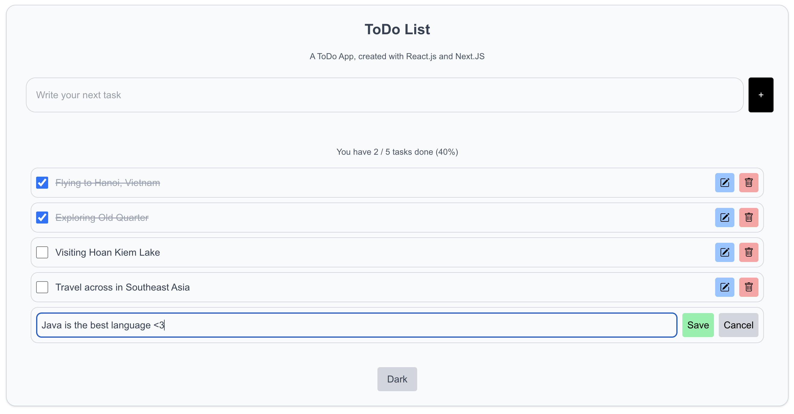

# ToDo App




A simple ToDo application built with Next.js, React, and Redux. This project was created as part of an internship to demonstrate modern web development practices.

## Features

*   Add new todos
*   Mark todos as complete
*   Delete todos
*   Edit existing todos
*   Dark/Light theme toggle

## Technologies Used

*   [Next.js](https://nextjs.org/)
*   [React](https://reactjs.org/)
*   [Redux Toolkit](https://redux-toolkit.js.org/)
*   [Tailwind CSS](https://tailwindcss.com/)

## Getting Started

First, clone the repository:

```bash
git clone <repository-url>
```

Then, install the dependencies:

```bash
npm install
```

Finally, run the development server:

```bash
npm run dev
```

Open [http://localhost:3000](http://localhost:3000) with your browser to see the result.
